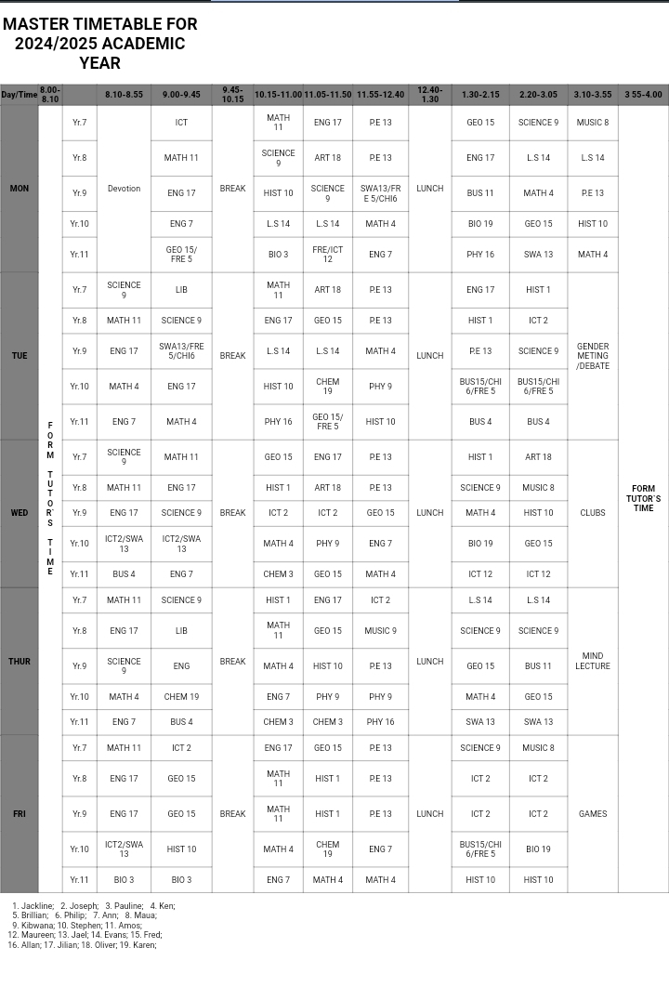

# IYFTimetable
README.md# Master Timetable for 2024/2025 Academic Year

## Project Overview
- This project provides a structured and visually appealing timetable designed for organizing daily class schedules during the academic year 2024/2025. It utilizes **HTML** for the layout and **CSS** for styling to ensure a professional presentation.

## Contents
1. **index.html**: The main HTML file containing the timetable structure.
2. **styles.css**: The external CSS file for applying styles to the timetable.
3. **timetable_preview.png**: A screenshot showcasing the appearance of the timetable layout in the browser.
4. **README.md**: This documentation file providing an overview and instructions for the project.

## Instructions
1. Clone or download the project folder to your computer.
2. Open the `index.html` file in any modern web browser to view the timetable.
3. Ensure that the `styles.css` file is located in the same folder as `index.html` for proper styling.
4. Refer to the `timetable_preview.png` file for a visual guide to the timetable's layout.

## Screenshots

_This screenshot shows the table layout as displayed in the browser._

## Additional Notes
- This project has been tested in multiple browsers (Google Chrome, Mozilla Firefox, Microsoft Edge) to ensure compatibility.
- You can customize the timetable entries and styling by editing the `index.html` and `styles.css` files.

## Author Information:
- Created by:PAULETTE NYAMBURA
- Email Address: pollypaulette9@gmail.com 
